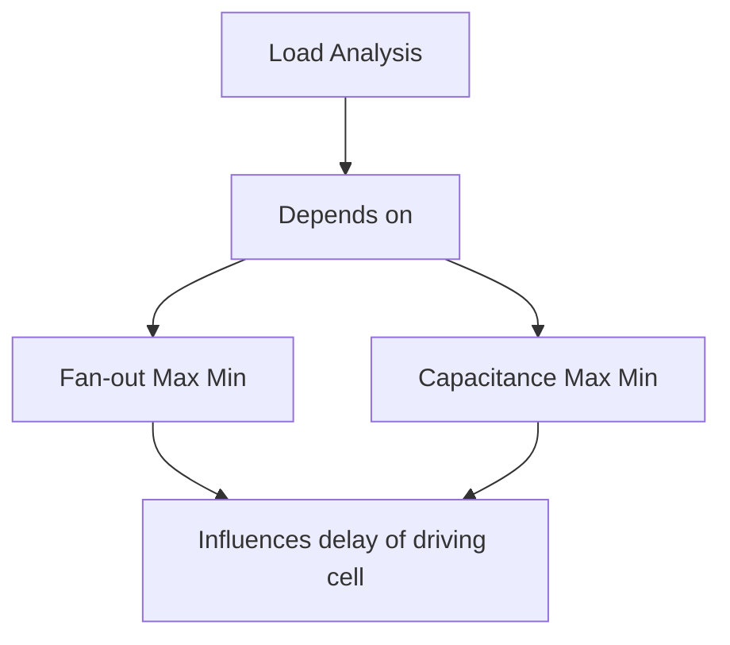
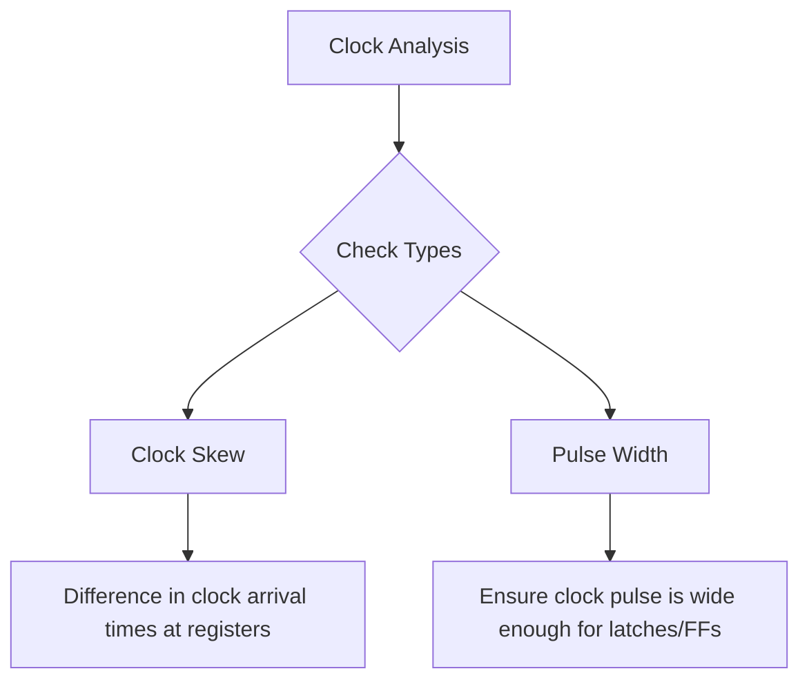

#  Part 2 – Fundamentals of Static Timing Analysis (STA)

**Creator & Mentor:** Kunal Koshwar  
**Week:** 3 – Part 2

This part focuses on understanding the **fundamentals of Static Timing Analysis (STA)** — how digital designs are verified for timing closure.  
The course provides in-depth knowledge of **timing checks**, **setup/hold analysis**, and **OCV impact**, but **does not cover constraints and library modeling**.

---

## Table of Contents

1. [Introduction to STA](#introduction-to-sta)  
2. [Timing Path and Key Parameters](#timing-path-and-key-parameters)  
   - [Arrival Time](#arrival-time)  
   - [Required Time](#required-time)  
   - [Slack](#slack)  
3. [Setup and Hold Analysis](#setup-and-hold-analysis)  
   - [Max (Setup) Analysis](#max-setup-analysis)  
   - [Min (Hold) Analysis](#min-hold-analysis)  
   - [Eight Types of Timing Checks](#eight-types-of-timing-checks)  
4. [STA Analysis Types](#sta-analysis-types)  
   - [Graph-Based Analysis (GBA)](#graph-based-analysis-gba)  
   - [Path-Based Analysis (PBA)](#path-based-analysis-pba)  
5. [Clock and Data Path Analysis](#clock-and-data-path-analysis)  
   - [Skew Analysis](#skew-analysis)  
   - [Transition (Slew) Analysis](#transition-slew-analysis)  
   - [Load Analysis](#load-analysis)  
   - [Pulse Width Analysis](#pulse-width-analysis)  
6. [Setup and Hold in Detail (with Example)](#setup-and-hold-in-detail-with-example)  
   - [Timing Graph (DAG)](#timing-graph-dag)  
   - [Setup Calculation Example](#setup-calculation-example)  
   - [Hold Calculation Example](#hold-calculation-example)  
7. [Flip-Flop Internal Timing](#flip-flop-internal-timing)  
   - [Pass Transistor Logic](#pass-transistor-logic)  
   - [Master-Slave Configuration](#master-slave-configuration)  
   - [Setup and Hold Time Definitions](#setup-and-hold-time-definitions)  
8. [Jitter and Uncertainty](#jitter-and-uncertainty)  
   - [Eye Diagram Analysis](#eye-diagram-analysis)  
   - [Causes of Jitter](#causes-of-jitter)  
   - [Slack Calculation with Uncertainty](#slack-calculation-with-uncertainty)  
9. [On-Chip Variation (OCV)](#on-chip-variation-ocv)  
   - [Definition and Sources](#definition-and-sources)  
   - [Clock Pull-in and Push-out](#clock-pull-in-and-push-out)  
   - [Pessimism Removal](#pessimism-removal)  
10. [Conclusion](#conclusion)

---

## Introduction to STA

**Static Timing Analysis (STA)** is a method to verify the timing of a digital circuit **without applying any input vectors**.  
It checks if all timing paths meet required performance by analyzing **propagation delays**, **setup**, and **hold times**.

STA ensures that every **data signal** arrives and stabilizes at the correct time relative to its **clock signal**.

---

##  Timing Path and Key Parameters

Assume **timing path** typically consists of:  
**Launch Flip-Flop → Combinational Logic → Capture Flip-Flop**


### Arrival Time
Time taken for data to propagate from the **start point** (e.g., register output) to the **endpoint** (register input).

### Required Time
Time by which the data **must arrive** at the capture register to satisfy setup or hold constraints.

### Slack
```text
Slack = Required Time - Arrival Time
```
- Positive Slack → No violation
- Negative Slack → Timing violation
---

## Types of Setup & Hold Analysis:
```table
#  | Timing Type              | Description
---|--------------------------|-------------------------------------------
1  | Register to Register     | Between two sequential elements
2  | Input to Register        | From input port to register
3  | Register to Output       | From register to output port
4  | Input to Output          | Combinational path from input to output
5  | Clock Gating Check       | Ensures enable signal stability
6  | Recovery/Removal         | Checks asynchronous signals like reset
7  | Data to Data             | Combinational data dependency
8  | Latch Time Borrow/Given  | Accounts for latch transparency time
```
### Transition (Slew) Analysis
```mermaid
flowchart TD
    A[Transition (Slew) Analysis] --> B[Measures rise/fall time of a signal]
    B --> C[Branch by Type]
    C --> D[Data Slew (Min/Max)]
    C --> E[Clock Slew (Min/Max)]
    D --> F[Large slew → Slower transition → Increased delay]
    E --> G[Clock transitions tighter than Data → must be stable during toggle]
```

### Load Analysis

### Clock Analysis

---