# Part 3 – Generate Timing Graphs with OpenSTA
---

## Objective
The purpose of this README is to document the **OpenSTA timing analysis workflow**, including installation, running example analyses, and comparing timing slacks for different designs.  
This task focuses on understanding **timing behavior, slack calculation, and critical path evaluation** using OpenSTA.

---
## Installation Guide
### CUDD Installation

```bash
cd
git clone https://github.com/ivmai/cudd.git
cd cudd
autoreconf -I
mkdir build
cd build
../configure --prefix=$HOME/cudd
make
make install
```


---

### Installation of OpenSTA
```bash
sudo apt-get update
sudo apt-get install build-essential tcl-dev tk-dev cmake git libeigen3-dev autoconf m4 perl automake 

git clone https://github.com/The-OpenROAD-Project/OpenSTA.git
cd OpenSTA
cd build
cmake .. -DUSE_CUDD=ON -DCUDD_DIR=$HOME/cudd
make
sudo make install
sta
```
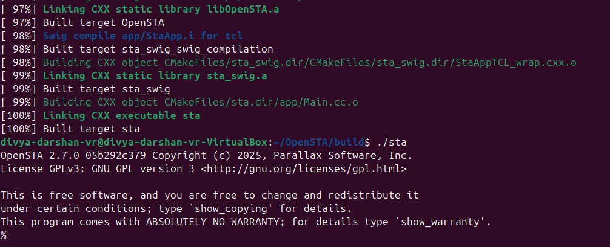

---
## Example Timing Analysis

### Step 1 : Verilog Module
- This module is given by OpenSTA as `example1.v` 

```verilog
module top (in1, in2, clk1, clk2, clk3, out);
  input in1, in2, clk1, clk2, clk3;
  output out;
  wire r1q, r2q, u1z, u2z;

  DFF_X1 r1 (.D(in1), .CK(clk1), .Q(r1q));
  DFF_X1 r2 (.D(in2), .CK(clk2), .Q(r2q));
  BUF_X1 u1 (.A(r2q), .Z(u1z));
  AND2_X1 u2 (.A1(r1q), .A2(u1z), .ZN(u2z));
  DFF_X1 r3 (.D(u2z), .CK(clk3), .Q(out));
endmodule 
```
---
### Step 2: Synthesis

```bash
cd /OpenSTA/examples/
yosys
read_liberty -lib nangate45_slow.lib.gz
read_verilog example1.v
synth -top top
show
```
**Screenshot** : Synthesizing terminal output

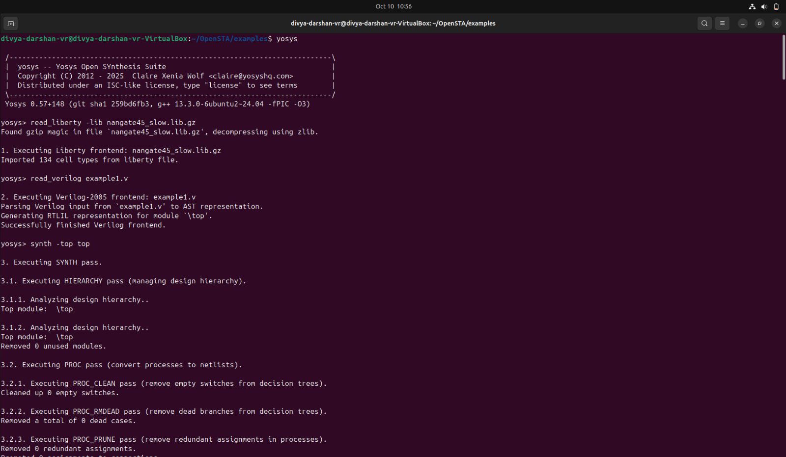

**Screenshot** : Stats of cells used 

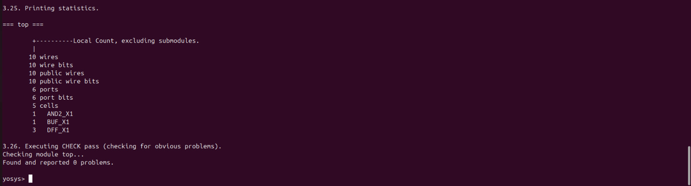

---

### Step 3 : Timing analysis using OpenSTA

```bash
        sta
```
- After launching the OpenSTA interactive shell (denoted by the `%` prompt), you can run the following commands to carry out a basic static timing analysis:

```bash
# Load the standard cell timing library (Liberty format)
read_liberty ./OpenSTA/examples/nangate45_slow.lib.gz

# Load the gate-level Verilog netlist
read_verilog ./OpenSTA/examples/example1.v

# Link the top-level module with the loaded timing library
link_design top

# Define a 10 ns clock named 'clk' for inputs clk1, clk2, and clk3
create_clock -name clk -period 10 {clk1 clk2 clk3}

# Set input delay of 0 ns for signals in1 and in2 relative to clock 'clk'
set_input_delay -clock clk 0 {in1 in2}

# Generate a timing check report for the design (By default it do setup/max checks)
report_checks

# Generate a timing check report for min check 
report_checks -path_delay min
```
**Screenshot**: Terminal Output of STA Commands

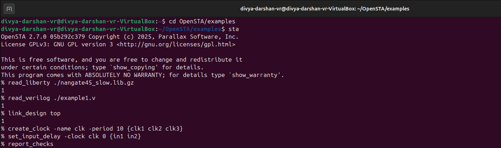

**Screenshot** : 
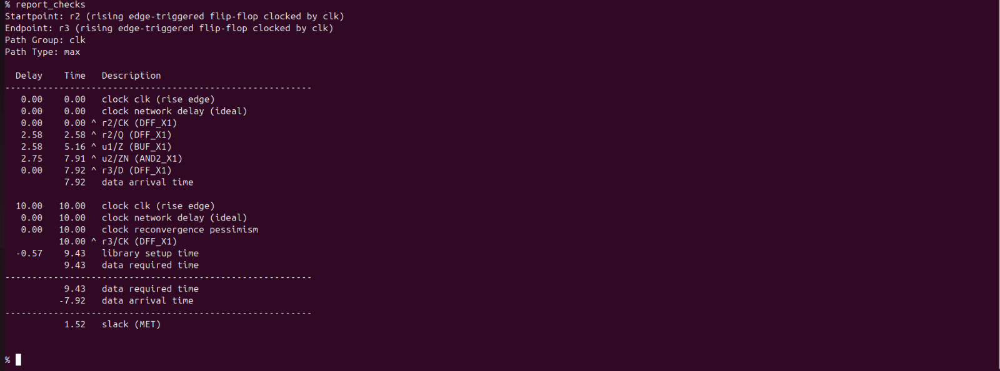

**Screenshot** : 
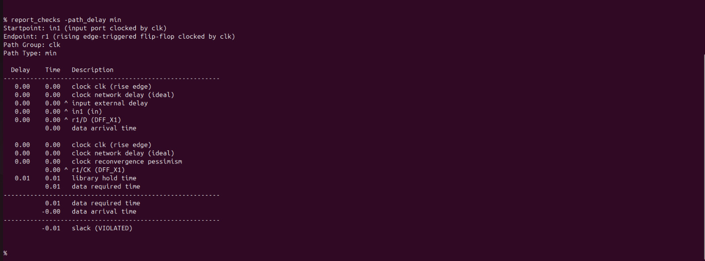

**Screenshot** : Synthesized design 
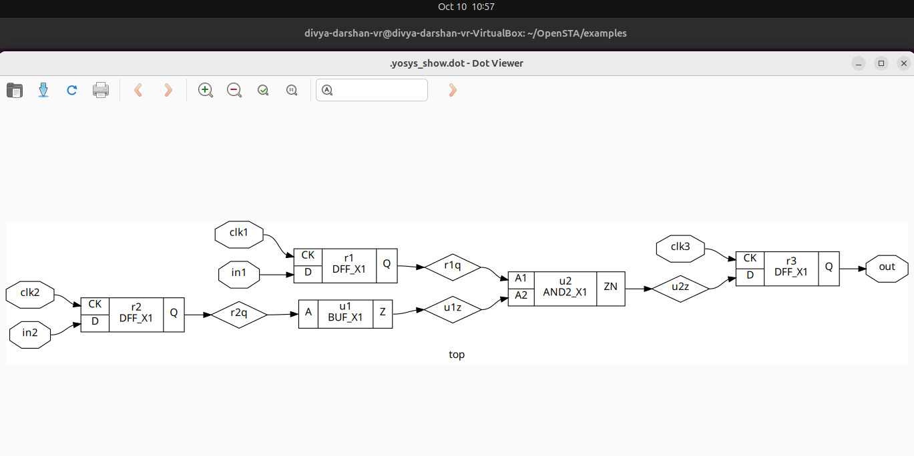
 
---

## Analysis of Timing :

| **Parameter** | **Description**      | **Value (ns)** |
|:--------------|:---------------------|:--------------:|
| **r2/Q**      | Clock-to-Q delay      | 0.23 |
| **u1**        | Buffer delay          | 0.08 |
| **u2**        | AND2 delay            | 0.10 |
| **Clock Period** | –                  | 10.00 |
| **Library Setup Time** | –            | -0.16 |

---

### Timing Calculations

**Data Arrival Time (tarrival):**
```bash 
tarrival = tclk_q + tbuf + tand
tarrival = 0.23 + 0.08 + 0.10 = 0.41 ns
```

**Data Required Time (trequired):**
```bash
trequired = Tclk - tsetup
trequired = 10 - 0.16 = 9.84 ns
```
**Slack Calculation**
```bash
Slacksetup = trequired - tarrival
Slacksetup = 9.84 - 0.41 = 9.43 ns (Positive → MET)
```

###  Observation

- The **setup slack is positive (9.43 ns)** → **timing is met**.  
- There is a **large timing margin**, meaning the circuit can tolerate extra delay.  
- The **negative setup time (-0.16 ns)** effectively increases the available time, aiding timing closure.

---

##  Hold Time Analysis

For the **hold check**, we consider the **shortest data path**.

**Data Arrival Time (tarrival_min):** 
```bash 
tarrival_min = tclk_q + tcomb_min
tarrival_min = 0.00 ns
```

**Data Required Time (trequired_hold):**  
```bash
trequired_hold = thold
trequired_hold = 0.01 ns
```
**Slack Calculation**
```bash
Slackhold = tarrival_min − trequired_hold
Slackhold = 0.00 − 0.01
Slackhold = −0.01 ns (VIOLATED)
```
### Observation
- The **hold slack is negative (−0.01 ns)** → **Hold timing is violated**.  
- This indicates that data is arriving **too early** at the capture flip-flop before it becomes stable for the next clock edge.  
- The path therefore **fails the hold requirement**, causing a potential data corruption risk.

---

## SPEF-Based Timing Analysis

**Definition:**  
**SPEF** is a standardized textual file format that provides detailed parasitic information (resistance, capacitance, and sometimes inductance) of a chip’s routing interconnects, which is used for **accurate post-layout timing analysis (STA)**.

### Key Points:
- Captures **RC parasitics** of nets after placement and routing.  
- Used by **Static Timing Analysis (STA) tools** to compute **delay, slew, and crosstalk effects**.  
- Ensures **timing closure** by reflecting realistic interconnect delays.  
- Comes in two main types:  
  - **Unit SPEF:** resistances in ohms, capacitances in farads.  
  - **Scaled SPEF:** values scaled by a factor for readability.  

**Summary:**  
SPEF bridges the gap between layout parasitics and accurate timing analysis.

---
### Steps to do SPEF Based Timing Analysis
```bash
# Change to the directory containing OpenSTA examples
cd OpenSTA/examples

# Invoke the OpenSTA tool
sta

# Load the standard cell timing library (Liberty format)
read_liberty ./nangate45_slow.lib.gz

# Load the gate-level Verilog netlist for analysis
read_verilog ./example1.v

# Link the top-level module in the Verilog netlist with the loaded timing library
link_design top

# Load the parasitic SPEF file for accurate delay calculation
read_spef ./example1.dspef

# Define a 10 ns clock named 'clk' for signals clk1, clk2, and clk3
create_clock -name clk -period 10 {clk1 clk2 clk3}

# Set input delay of 0 ns for signals in1 and in2 relative to the clock 'clk'
set_input_delay -clock clk 0 {in1 in2}

# Generate timing report for max check
report_checks

# Generate timing report for min check
report_checks -path_delay min
```
**Screenshot** : Terminal output of the tcl script

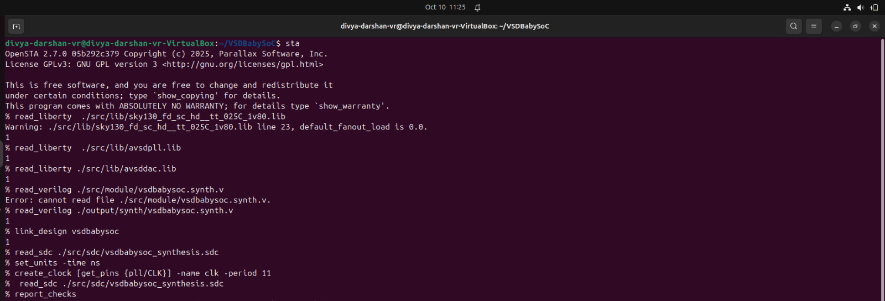

**Screenshot**: SPEF Based Max path Check 

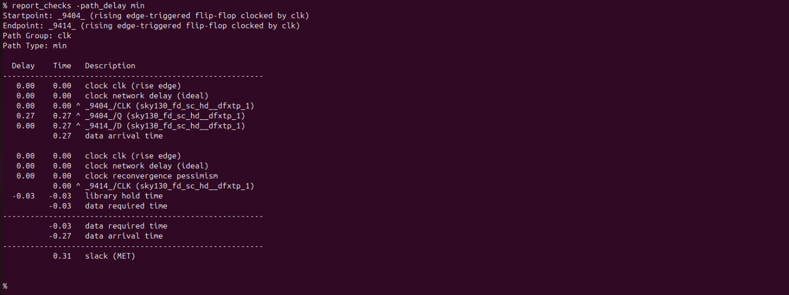

---
**Screenshot**: SPEF Based Min path Check 
 

 ---
## Capacitance Analysis
- generate a report of parasitic or electrical checks with a focus on capacitances 
```bash
report_checks -digits 4 -fields capacitance
```
 

 ---
 ```bash
report_checks -digits 4 -fields [list capacitance slew input_pins fanout]
```
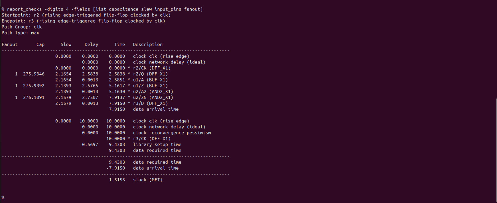

---
## Power Report Analysis
- Generates a **power analysis report** for your design.
- Computes **dynamic, static, and total power** for the circuit.

**Command:**
```bash
report_power
```
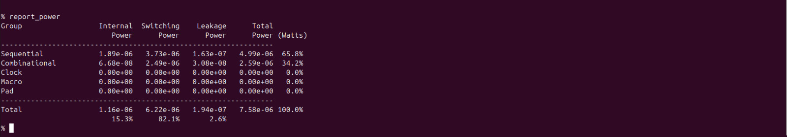

---

## Pulse Width Checks (`report_pulse_width_checks`)

- Checks the **pulse width of signals** in your design.
- Ensures that **short glitches or narrow pulses** do not violate timing constraints.
- Important for **setup/hold integrity** and **avoiding false switching**.

**Command:**
```bash
report_pulse_width_checks
```
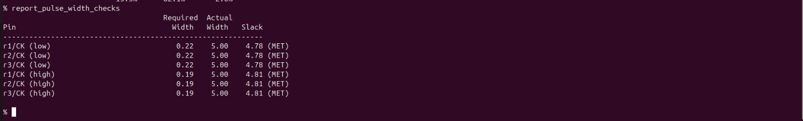

---
## Report Units (`report_units`)
- Displays the **units of measurement** currently used in the STA tool.

**Command:**
```bash
report_units
```
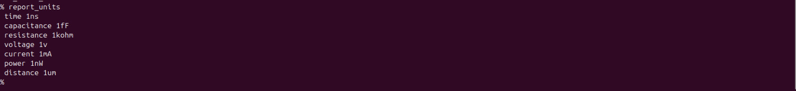

---
## Timing Report Comparison: Without SPEF vs With SPEF

| Node / Signal                  | Without SPEF Delay / Time (ns) | With SPEF Delay / Time (ns) |
|--------------------------------|-------------------------------|-----------------------------|
| clock clk (rise edge)           | 0.00 / 0.00                   | 0.00 / 0.00                 |
| clock network delay (ideal)     | 0.00 / 0.00                   | 0.00 / 0.00                 |
| ^ r2/CK (DFF_X1)               | 0.00 / 0.00                   | 0.00 / 0.00                 |
| r2/Q (DFF_X1)                  | 0.23 / 0.23                   | 2.58 / 2.58                 |
| u1/Z (BUF_X1)                  | 0.08 / 0.31                   | 2.58 / 5.16                 |
| u2/ZN (AND2_X1)                | 0.10 / 0.41                   | 2.75 / 7.91                 |
| r3/D (DFF_X1)                  | 0.00 / 0.41                   | 0.00 / 7.92                 |
| **Data Arrival Time**           | 0.41                           | 7.92                         |
| clock clk (rise edge)           | 10.00 / 10.00                  | 10.00 / 10.00                |
| clock network delay (ideal)     | 0.00 / 10.00                   | 0.00 / 10.00                 |
| clock reconvergence pessimism   | 0.00 / 10.00                   | 0.00 / 10.00                 |
| r3/CK (DFF_X1)                 | 10.00 / 10.00                  | 10.00 / 10.00                |
| Library Setup Time              | -0.16 / 9.84                   | -0.57 / 9.43                 |
| **Data Required Time**          | 9.84                            | 9.43                         |
| **Slack**                       | ✅ 9.43 (MET)                  | ⚠️ 1.52 (MET)                |

### Observation

- Including **SPEF parasitics** significantly increases the **delays** along the data path.  
- **Data arrival time** at `r3/D` increases from **0.41 ns → 7.92 ns**.  
- **Slack decreases** from **9.43 ns → 1.52 ns**, though it still meets the setup requirement.  
- The increase in delay is mainly due to **interconnect capacitance and resistance** captured in the SPEF file.  
- This highlights the importance of considering **post-layout parasitics** for accurate timing analysis.
---
## Timing Libraries for Multi-PVT Analysis

The timing libraries required for this analysis can be downloaded from the **SkyWater PDK**:

- **SkyWater PDK – sky130_fd_sc_hd Timing Libraries**  
  - These libraries provide **process-, voltage-, and temperature-specific timing models** needed for accurate STA.  
  - You can download them from the official [SkyWater PDK repository](https://github.com/google/skywater-pdk) or the timing library package link provided by the PDK.
---
## Timing Analysis of VSDBabySoc

```bash
cd Desktop/SoC/VSDBabySoC
sta

# Load Liberty Libraries (standard cell + IPs)
read_liberty  ./src/lib/sky130_fd_sc_hd__tt_025C_1v80.lib
read_liberty  ./src/lib/avsdpll.lib
read_liberty ./src/lib/avsddac.lib

# Read Synthesized Netlist
read_verilog ./src/module/vsdbabysoc.synth.v

# Link the Top-Level Design
link_design vsdbabysoc

# Apply SDC Constraints
read_sdc ./src/sdc/vsdbabysoc_synthesis.sdc
 
#SDC Constraints
set_units -time ns
create_clock [get_pins {pll/CLK}] -name clk -period 11

# Generate Timing Report (by default max path)
report_checks

# Generate Timing Report for min path
report_checks -path_delay min
```
**Screenshot**: Terminal Output
 


---
**Screenshot**: VSDBabySoC Timing report for max path
 
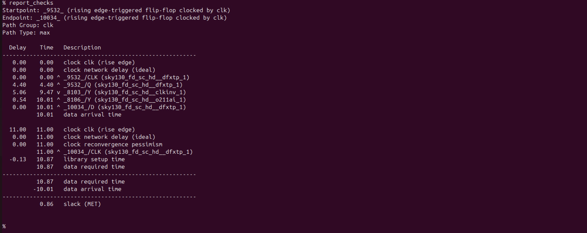

---
**Screenshot**: VSDBabySoC Timing report for min path
 


---
## Multi-PVT Corner Timing Analysis of VSDBabySoC using OpenSTA

## Multi-PVT Corners in STA

**Definition:**  
In **Static Timing Analysis (STA)**, **Multi-PVT Corners** refer to evaluating the design under multiple combinations of **Process, Voltage, and Temperature (PVT)** conditions. These corners help ensure that the design **meets timing constraints across all expected operating conditions**.

### Components of PVT:

1. **Process (P):**  
   - Variations in manufacturing, e.g., **slow (SS), typical (TT), fast (FF)** transistors.
   - Accounts for **chip-to-chip variability**.

2. **Voltage (V):**  
   - Variations in supply voltage, e.g., **nominal, high, low**.
   - Ensures timing is robust against **power supply fluctuations**.

3. **Temperature (T):**  
   - Variations in operating temperature, e.g., **-40°C, 25°C, 125°C**.
   - Models the effect of **thermal conditions** on transistor speed.

### Purpose of Multi-PVT Corners:

- STA at a **single corner** is insufficient for real-world conditions.  
- Multi-PVT analysis ensures the **design meets timing and functional requirements** under all expected scenarios:  
  - **Fast Process + High Voltage + Low Temperature** → fastest circuits, check **hold violations**.  
  - **Slow Process + Low Voltage + High Temperature** → slowest circuits, check **setup violations**.  

  **Example Scenarios:**

- **Fast Corner:** FF transistors at **-40 °C, 1.95 V** → circuits are faster; checks **hold violations** (data may arrive too early).  
- **Slow Corner:** SS transistors at **100 °C, 1.40 V** → circuits are slower; checks **setup violations** (data may arrive too late).  

## Using the Multi-PVT TCL Script for STA

We are going to use the `multi_pvt_corners.tcl` script to **automate Static Timing Analysis (STA) across multiple PVT corners**. This allows us to verify that the design meets timing constraints under all **process, voltage, and temperature conditions** without manually switching libraries or rerunning analyses.

### Steps Performed by the Script:

1. **Load PVT-specific timing libraries**  
   - Example: `sky130_fd_sc_hd__ss_100C_1v40.lib` for a **slow-slow, high-temperature, low-voltage** corner.  

2. **Link the synthesized netlist**  
   - Ensures the same RTL design is used for all corners.  

3. **Apply SDC constraints**  
   - Clocks, input/output delays, and timing exceptions are applied consistently for each corner.  

4. **Run timing checks**  
   - Includes **setup, hold, worst negative slack (WNS), total negative slack (TNS)** for each corner.  

5. **Save detailed reports**  
   - Generates a **separate report for each PVT corner** under `./sta_outputs/` for analysis.  

### Benefits:

- Provides **comprehensive timing validation** across all operating conditions.  
- Automates repetitive STA tasks, saving **time and effort**.  
- Identifies **worst-case paths** for setup and hold, ensuring reliable chip operation.  


**SDC Constraints For VSDBabySoC**

```bash
# =============================================================================
# SDC Constraints for vsdbabysoc Module (synthesised netlist)
# Generated for OpenSTA Static Timing Analysis
# Clock period: 11 ns (~90.9 MHz)
# =============================================================================

set_units -time ns

# Clock definition
create_clock -name clk -period 11 [get_pins pll/CLK]

set_clock_latency -source 2 [get_clocks clk]
set_clock_latency 1 [get_clocks clk]
set_clock_uncertainty -setup 0.5 [get_clocks clk]
set_clock_uncertainty -hold 0.5 [get_clocks clk]

# Design constraints
set_max_area 8000
set_max_fanout 5 vsdbabysoc
set_max_transition 10 vsdbabysoc

# Input constraints
set_input_delay -clock clk -max 4 [get_ports {reset VCO_IN ENb_CP ENb_VCO REF VREFH}]
set_input_delay -clock clk -min 1 [get_ports {reset VCO_IN ENb_CP ENb_VCO REF VREFH}]
set_input_transition -max 0.4 [get_ports {reset VCO_IN ENb_CP ENb_VCO REF VREFH}]
set_input_transition -min 0.1 [get_ports {reset VCO_IN ENb_CP ENb_VCO REF VREFH}]

# Output constraints
set_load -max 0.5 [get_ports OUT]
set_load -min 0.5 [get_ports OUT]
set_output_delay -clock clk -max 0.5 -clock clk [get_ports OUT]
set_output_delay -clock clk -min 0.5 -clock clk [get_ports OUT]

# Path delay
set_max_delay 10 -from [get_clocks clk] -to [get_ports OUT]
```
## How to run Multi-PVT corner analysis
```bash
# Go to OpenSTA interactive shell (denoted by %)
sta

source multi_pvt_corners.tcl
```
---
## STA Output
- After successfull analysis of `multi pvt corners`, it produces 4 output files.
They are.
```bash
sta_tns.txt
sta_wns.txt
sta_worst_max_slack.txt
sta_worst_min_slack.txt
```
**Screenshot of sta_worst_max_slack.txt**


---
**Screenshot of sta_worst_min_slack.txt**

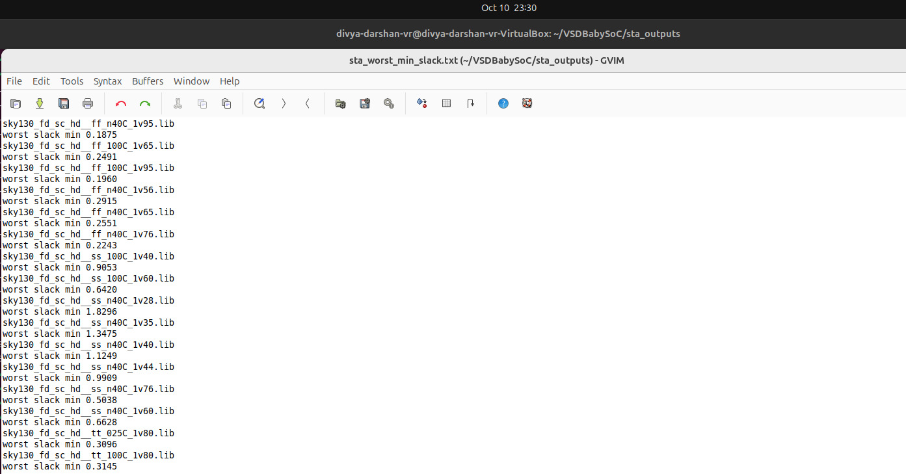

---
**Screenshot of sta_wns.txt**

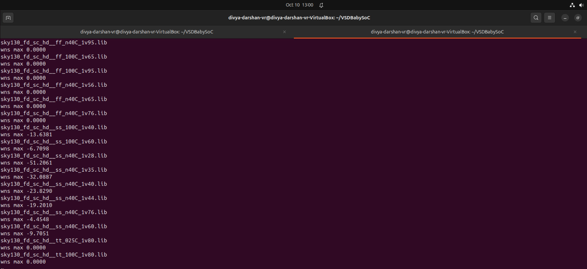

---
**Screenshot of sta_tns.txt**

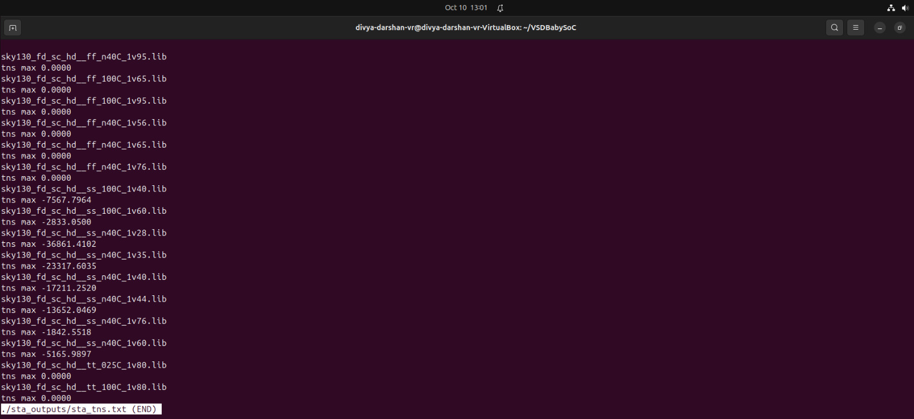

---
# Multi-PVT Timing Summary Report

This report summarises the *setup and hold timing performance* across multiple PVT (Process, Voltage, Temperature) corners analysed using *OpenSTA* for the vsdbabysoc design.

---

## Timing Summary Table

| Library Corner     | Max/Worst Max Slack (Setup) | Min/Worst Min Slack (Hold) | WNS          | TNS          | Observation                     |
|-------------------|-----------------------------|----------------------------|--------------|--------------|--------------------------------|
| ff_n40C_1v95      | 🟩 +3.8703                  | 🟩 +0.1875                 | 🟩 0.0000    | 🟩 0.0000    | Strong setup, hold OK          |
| ff_100C_1v65      | 🟩 +2.2764                  | 🟩 +0.2491                 | 🟩 0.0000    | 🟩 0.0000    | Setup OK, hold OK              |
| ff_100C_1v95      | 🟩 +3.7138                  | 🟩 +0.1960                 | 🟩 0.0000    | 🟩 0.0000    | Excellent setup, hold OK       |
| ff_n40C_1v56      | 🟩 +0.8214                  | 🟩 +0.2915                 | 🟩 0.0000    | 🟩 0.0000    | OK setup, good hold margin     |
| ff_n40C_1v65      | 🟩 +1.8597                  | 🟩 +0.2551                 | 🟩 0.0000    | 🟩 0.0000    | Setup good, hold OK            |
| ff_n40C_1v76      | 🟩 +2.7707                  | 🟩 +0.2243                 | 🟩 0.0000    | 🟩 0.0000    | Fast corner stable             |
| ss_100C_1v40      | 🟥 −13.6381                 | 🟩 +0.9053                 | 🟥 −13.6381  | 🟥 Large     | Major setup fail               |
| ss_100C_1v60      | 🟥 −6.7098                  | 🟩 +0.6420                 | 🟥 −6.7098   | 🟥 Large     | Setup fail                     |
| ss_n40C_1v28      | 🟥 −51.2061                 | 🟩 +1.8296                 | 🟥 −51.2061  | 🟥 Severe    | Severe setup fail              |
| ss_n40C_1v35      | 🟥 −32.0887                 | 🟩 +1.3475                 | 🟥 −32.0887  | 🟥 Large     | Setup fail                     |
| ss_n40C_1v40      | 🟥 −23.8290                 | 🟩 +1.1249                 | 🟥 −23.8290  | 🟥 Large     | Setup fail                     |
| ss_n40C_1v44      | 🟥 −19.2010                 | 🟩 +0.9909                 | 🟥 −19.2010  | 🟥 Large     | Setup fail                     |
| ss_n40C_1v76      | 🟥 −4.4548                  | 🟩 +0.5038                 | 🟥 −4.4548   | 🟥 Large     | Setup fail                     |
| ss_n40C_1v60      | 🟥 −9.7051                  | 🟩 +0.6628                 | 🟥 −9.7051   | 🟥 Large     | Setup fail                     |
| tt_025C_1v80      | 🟩 +0.8595                  | 🟩 +0.3096                 | 🟩 0.0000    | 🟩 0.0000    | Typical corner OK              |
| tt_100C_1v80      | 🟩 +0.9354                  | 🟩 +0.3145                 | 🟩 0.0000    | 🟩 0.0000    | Typical-hot OK                 |

---

### Legend

| Symbol | Meaning                 | Description                               |
|:------:|:-----------------------|:-----------------------------------------|
| 🟩     | PASS                    | Slack ≥ 0 ns → Meets timing              |
| 🟥     | FAILURE                 | Slack ≤ −1 ns → Fails timing             |

---

### Observations

1. 🟩 *FF (Fast-Fast)* and *TT (Typical-Typical)* corners meet setup & hold comfortably.  
2. 🟩 Hold slacks are positive across all corners — *no hold failures* observed.  
3. 🟥 *SS (Slow-Slow)* corners show significant setup violations due to *low voltage and high temperature*.  
4. 🟩 Classic trade-off observed:  
   - *Fast corners → Hold-critical* (short paths).  
   - *Slow corners → Setup-critical* (long paths).  
5. Worst setup violation at *ss_n40C_1v28* (−51.2061 ns) → severe slowdown under cold/low-voltage.  
6. Indicates need for *path optimization, retiming, or clock relaxation* to close setup timing at slow corners.  

---

### Heatmap 
In STA, a heatmap is used to visualize the timing slack of different paths under various conditions (PVT corners, clock domains, or corners vs cells). Each cell of the heatmap represents the slack of a particular path under a specific corner.

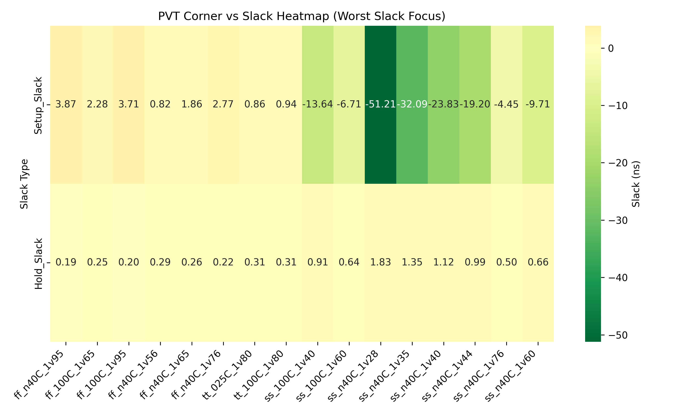

**Inference**
- Green → Worst slack (more negative or closer to violation)
- Light yellow → Best slack (more positive, safe)
---

1. **Worst Max Slack Across corners**

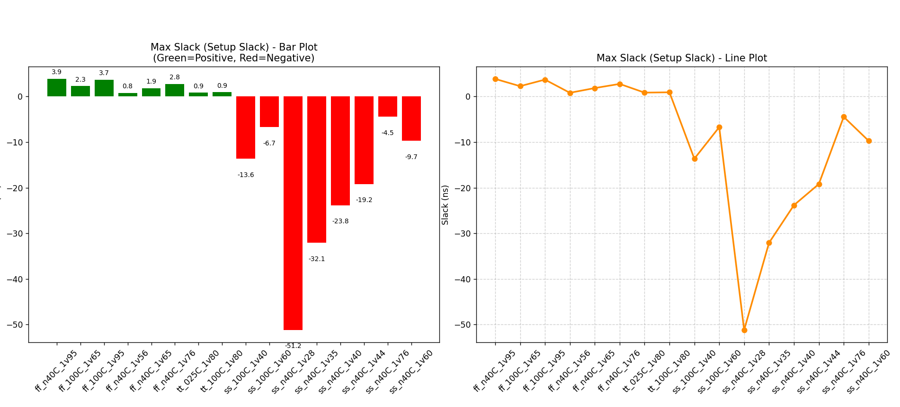

**Observation**
The Setup Slack values for most corners are positive, indicating timing is met for those corners.
The worst corner (ss_n40C_1v28) has the maximum setup slack (~-51.21 ns), showing a significant timing violation under the slow-slow (SS) corner at low voltage and low temperature.

---

2. **Worst Min Slack Across Corners**

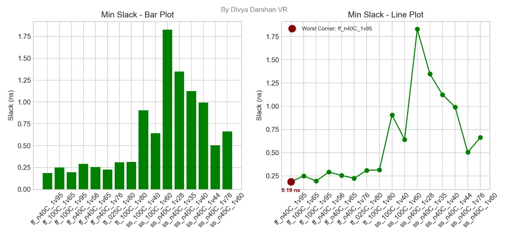

**Observation**
The Hold Slack values for most corners are positive, indicating no hold violations for those corners.
The worst corner (ss_n40C_1v28) has the minimum hold slack (~1.83 ns), highlighted in dark red.

---

3. **Worst Negative Slack Across Corners**

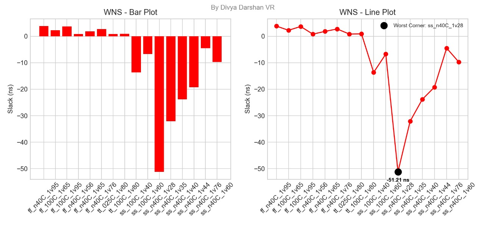

**Observation**
- Some corners have negative setup slack, indicating setup timing violations.
- The worst negative slack (WNS) occurs at ss_n40C_1v28 with -51.21 ns, highlighted in black.
---

4. **Total Negative Slack Across Corners**

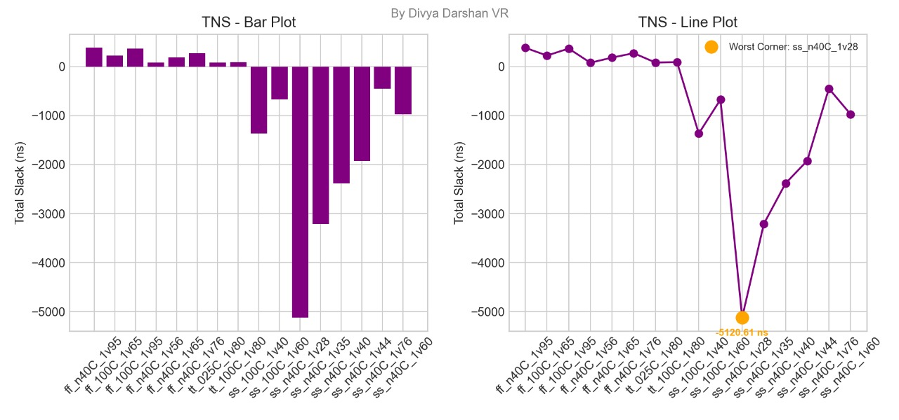

---
## Inference from Multi PVT Corners slack analysis

The analysis of hold slack, setup slack, and total negative slack across all process corners reveals that the worst-case timing occurs in the ss_n40C_1v28 corner, with significant setup violations. Hold timing is generally safe across corners. The total negative slack highlights cumulative violations, guiding optimization priorities. Focus should be on critical paths in the slowest corners to achieve timing closure and reliable operation.

---
##  Conclusion

- Fast (FF) and Typical (TT) corners meet timing comfortably; setup and hold slacks are positive.
- Slow-Slow (SS) corners, especially ss_n40C_1v28, show severe setup violations, indicating paths are too slow under low voltage and low temperature.
- Hold timing is safe across all corners; no early data capture issues observed.
- Optimization is needed for critical paths in slow corners: retiming, path restructuring, or clock adjustment.
- Overall, the design is robust in typical and fast conditions, but slow corners require attention to ensure reliable operation across all PVT scenarios.
---